# RAG (Retrieval-Augmented Generation) — Complete Guide

> **A comprehensive deep-dive into RAG pipelines, architecture, and best practices**

---

## 📋 Table of Contents

1. [What is RAG?](#what-is-rag)
2. [Why RAG? — Problem & Solution](#why-rag--problem--solution)
3. [RAG Pipeline Overview](#rag-pipeline-overview)
4. [Phase 1: Ingestion (Data Feeding)](#phase-1-ingestion-data-feeding)
5. [Phase 2: Retrieval & Generation (RAG)](#phase-2-retrieval--generation-rag)
6. [Vector Databases Explained](#vector-databases-explained)
7. [Chunking Strategies](#chunking-strategies)
8. [Embedding Models](#embedding-models)
9. [Retrieval Techniques](#retrieval-techniques)
10. [End-to-End Flow Diagram](#end-to-end-flow-diagram)
11. [Supported Document Types](#supported-document-types)
12. [Image & Video Support](#image--video-support)
13. [Popular Vector Databases](#popular-vector-databases)
14. [RAG vs Fine-Tuning](#rag-vs-fine-tuning)
15. [Common Challenges & Solutions](#common-challenges--solutions)
16. [Use Cases in QA & Testing](#use-cases-in-qa--testing)
17. [Glossary](#glossary)

---

## What is RAG?

**RAG** stands for **Retrieval-Augmented Generation**. It is a technique that enhances Large Language Models (LLMs) by providing them with relevant external knowledge retrieved from a knowledge base *at query time* — rather than relying solely on the model's internal (static) training data.

```mermaid
flowchart LR
    A[User Query] --> B{RAG System}
    B --> C[LLM Knowledge<br/>(Static/Training)]
    B --> D[External Knowledge<br/>(Dynamic/Retrieved)]
    C --> E[Generated Response]
    D --> E
```

### Core Idea

| Without RAG | With RAG |
|---|---|
| LLM answers from memory only | LLM answers with retrieved context |
| May hallucinate or be outdated | Grounded in fresh, relevant data |
| No access to private/custom data | Can query company docs, DBs, APIs |
| One-size-fits-all knowledge | Personalized, domain-specific answers |

---

## Why RAG? — Problem & Solution

### The Problem

LLMs are trained on a static snapshot of public internet data. They:

- ❌ **Don't know your private data** (JIRA tickets, internal docs, codebases)
- ❌ **Can be outdated** (training cutoff date)
- ❌ **Hallucinate** when guessing unknown facts
- ❌ **Can't cite sources** reliably

### The Solution — RAG

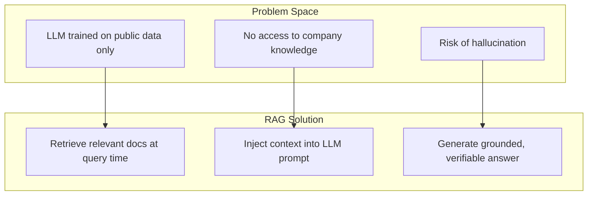

---

## RAG Pipeline Overview

The RAG pipeline consists of **two major phases**:

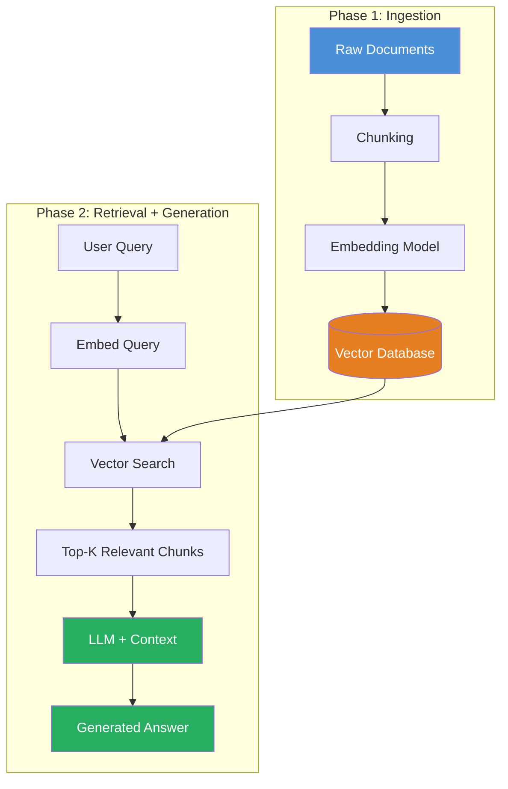

---

## Phase 1: Ingestion (Data Feeding)

Ingestion is the process of preparing and storing your knowledge base so it can be searched later.

### Step-by-Step Ingestion Flow

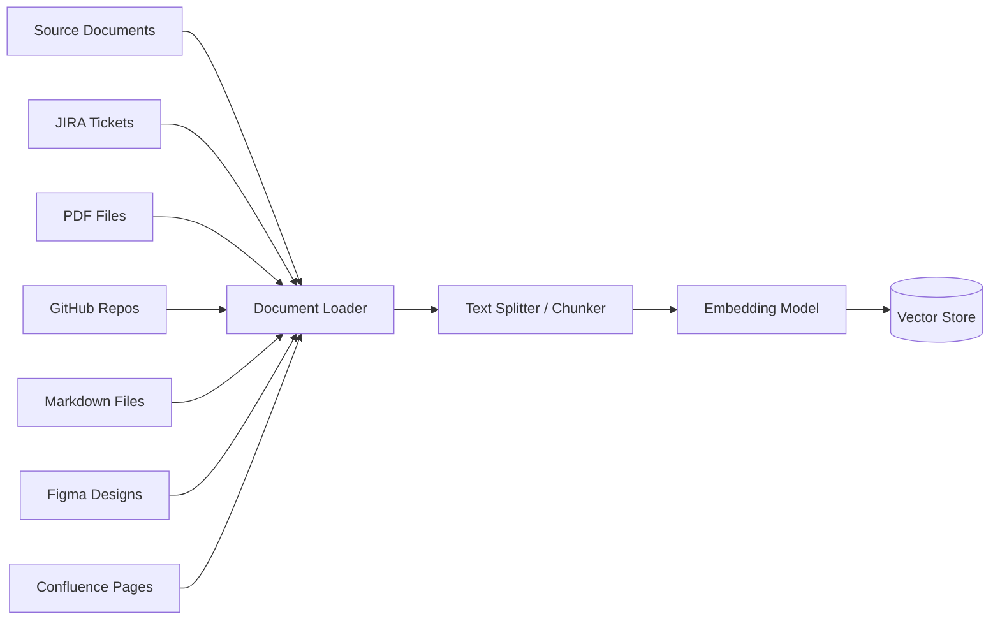

### What Can Be Ingested?

| Document Type | Supported? | Notes |
|---|---|---|
| **JIRA Tickets** | ✅ Yes | Export via API or CSV |
| **GitHub Repos** | ✅ Yes | Clone and parse code/docs |
| **PDF Files** | ✅ Yes | Extract text via OCR/parsers |
| **Markdown (.md)** | ✅ Yes | Native support |
| **Figma Designs** | ✅ Yes | Via Figma API / plugins |
| **HTML/Web Pages** | ✅ Yes | Web scraping |
| **Images** | ✅ Yes (paid) | Requires multimodal model subscription |
| **Videos** | ✅ Yes (paid) | Requires transcription + multimodal |

### Chunking

Documents are too large to feed directly into an LLM (context window limits). They are **split into smaller chunks**.

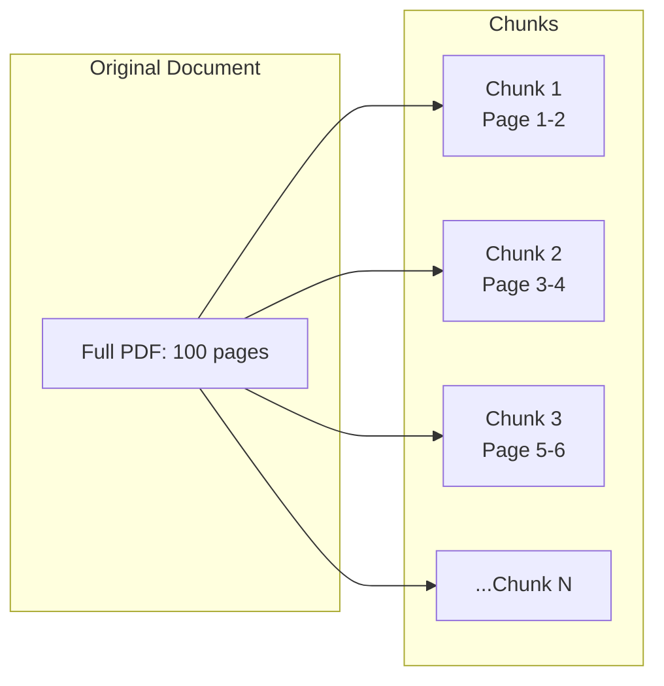

**Common chunking strategies:**

| Strategy | Description | Best For |
|---|---|---|
| **Fixed-size** | Split by token count (e.g., 512 tokens) | Simple documents |
| **Recursive** | Split by paragraphs, then sentences | Structured text |
| **Semantic** | Split by meaning/topic boundaries | Complex documents |
| **Document-specific** | Split by headers, sections | Markdown, HTML |

### Embedding

Each chunk is converted into a **vector (numerical representation)** using an embedding model.

```
"Bug in login page"  -->  [0.234, -0.567, 0.891, ...]  (768-dimensional vector)
```

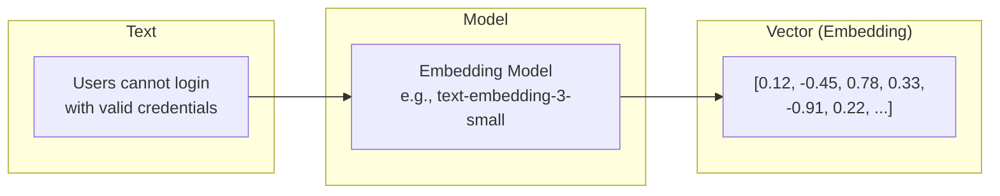

### Vector Database Storage

The embeddings are stored in a **Vector Database** along with the original text (metadata).

```
Vector DB Record:
┌────────────────────────────────────────────┐
│ ID: chunk_0042                             │
│ Vector: [0.12, -0.45, 0.78, ...]          │
│ Metadata: {                                │
│   "source": "JIRA-1234",                   │
│   "page": 3,                               │
│   "text": "Users cannot login...",         │
│   "date": "2025-01-15"                     │
│ }                                          │
└────────────────────────────────────────────┘
```

---

## Phase 2: Retrieval & Generation (RAG)

This is the **runtime** phase — when a user asks a question.

### The 3 Components of RAG

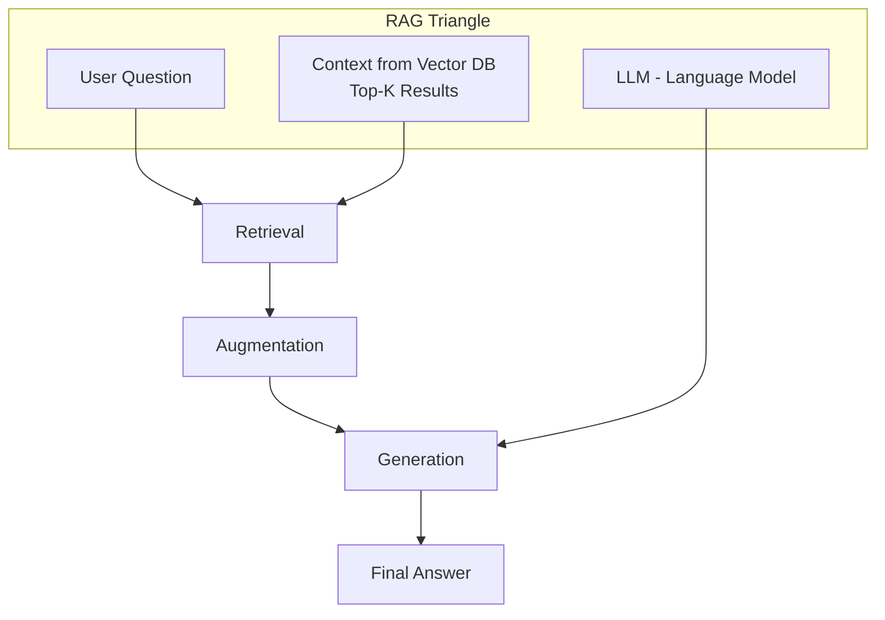

### Step-by-Step: What Happens at Query Time

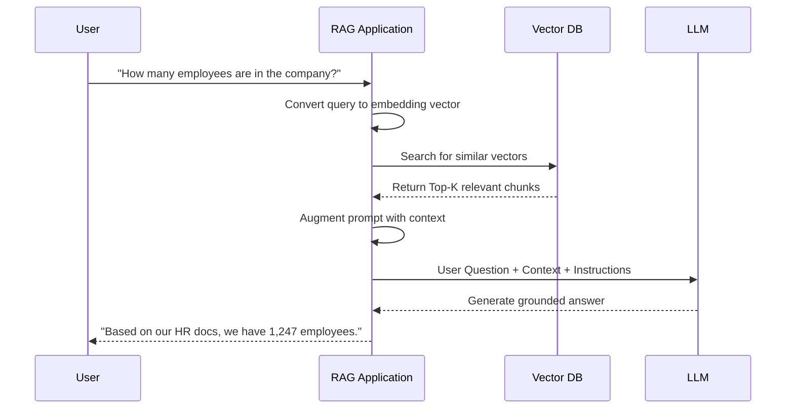

### Detailed Flow

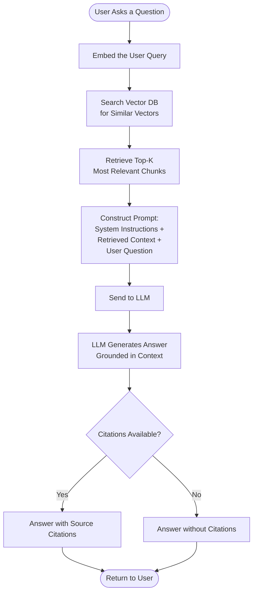

### The Augmented Prompt

```
SYSTEM: You are a helpful assistant. Answer the user's question
based ONLY on the provided context. If the context doesn't
contain the answer, say "I don't have that information."

CONTEXT:
[Chunk 1]: The company has 1,247 employees as of Q4 2025.
[Chunk 2]: Engineering department has 450 employees.
[Chunk 3]: HR is located on the 3rd floor.

USER QUESTION: How many employees are in the company?

ANSWER:
```

---

## Vector Databases Explained

### What is a Vector Database?

A **Vector Database** is a specialized database designed to store and search **vector embeddings** efficiently. Unlike traditional databases (which search by exact matches or SQL conditions), vector databases search by **semantic similarity**.

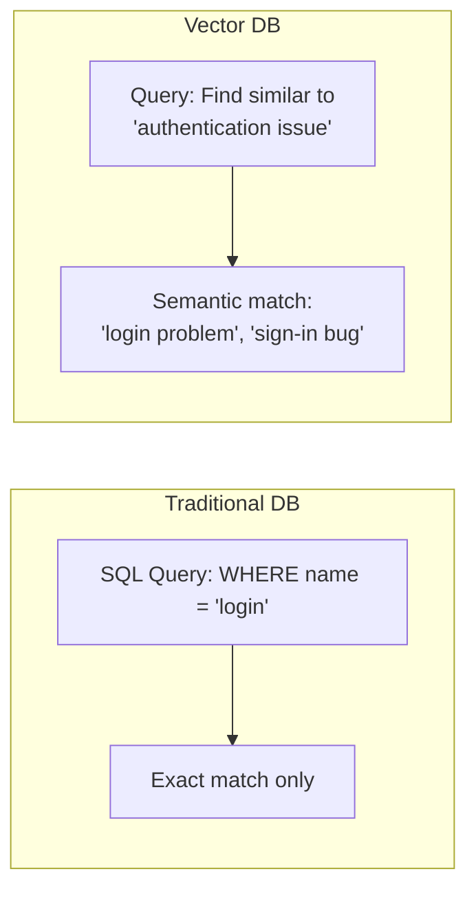

### How Vector Search Works

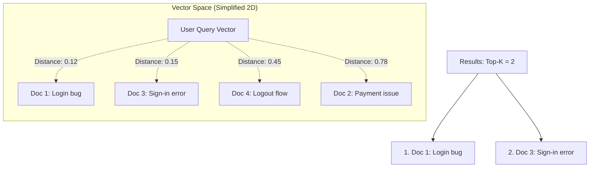

### Similarity Metrics

| Metric | Description | Use Case |
|---|---|---|
| **Cosine Similarity** | Measures angle between vectors | Most common for text |
| **Dot Product** | Measures magnitude + direction | When vectors are normalized |
| **Euclidean Distance** | Measures straight-line distance | Spatial data |
| **Manhattan Distance** | Sum of absolute differences | High-dimensional sparse data |

---

## Chunking Strategies — In Detail

Choosing the right chunk size is critical for RAG performance.

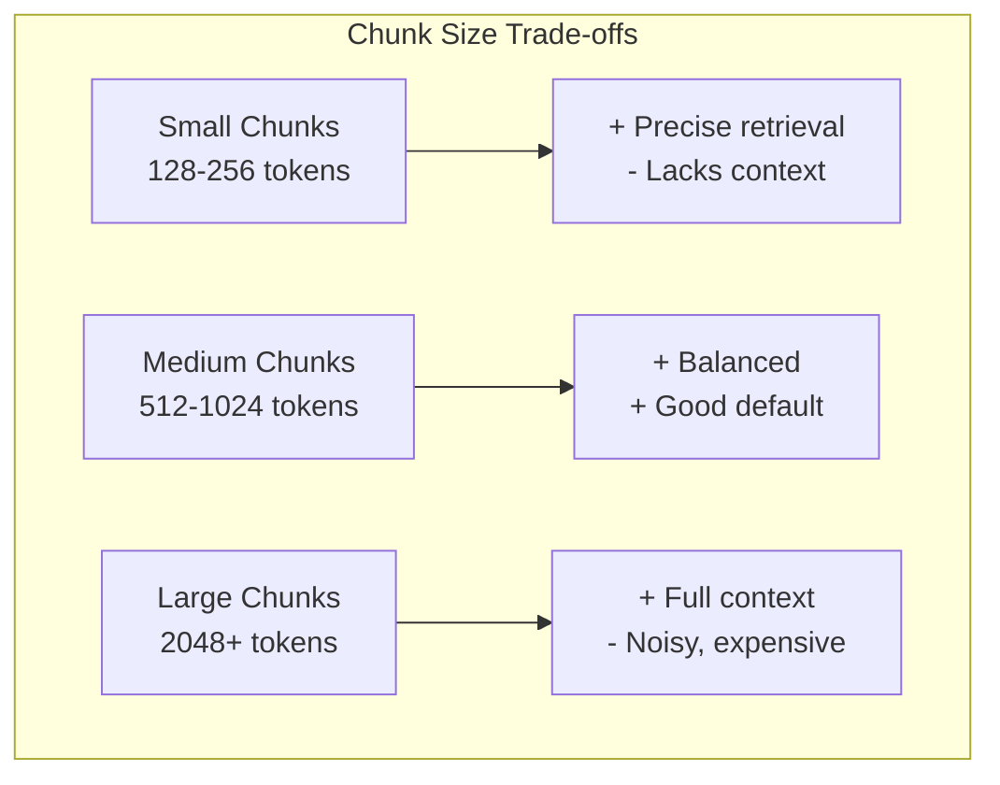

| Chunk Size | Pros | Cons | Best For |
|---|---|---|---|
| **Small** (128-256) | High precision, low cost | Missing surrounding context | FAQ, definitions |
| **Medium** (512-1024) | Good balance | Moderate cost | General purpose |
| **Large** (2048+) | Full context retained | Noise, high cost, may exceed context | Legal docs, contracts |

### Overlap Strategy

Chunks often overlap to avoid cutting sentences in half:

```
Chunk 1: "The login page has a bug where users cannot authenticate
Chunk 2: cannot authenticate with valid credentials. This affects all"
Chunk 3: "affects all users on the Chrome browser."
```

---

## Embedding Models

### Popular Embedding Models

| Model | Dimensions | Provider | Best For |
|---|---|---|---|
| `text-embedding-3-small` | 512-1536 | OpenAI | General purpose, cost-effective |
| `text-embedding-3-large` | 256-3072 | OpenAI | High accuracy |
| `BGE` (Base/Large) | 768-1024 | BAAI | Open-source, good multilingual |
| `all-MiniLM-L6-v2` | 384 | Sentence-Transformers | Lightweight, local |
| `mxbai-embed-large` | 1024 | Mixedbread | Open-source, high quality |
| `nomic-embed-text` | 768 | Nomic | Open-source, long context |

### Local vs Cloud Embeddings

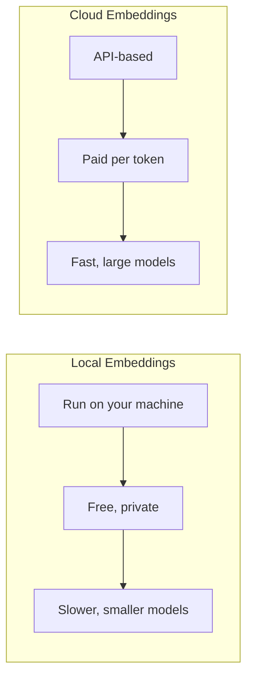

---

## Retrieval Techniques

### 1. Simple Vector Search (Naive RAG)

```
Query → Embed → Search → Top-K → LLM
```

### 2. Hybrid Search (Vector + Keyword)

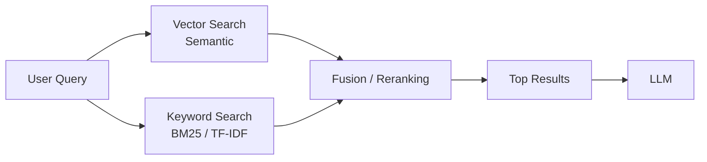

### 3. Multi-Query Retrieval

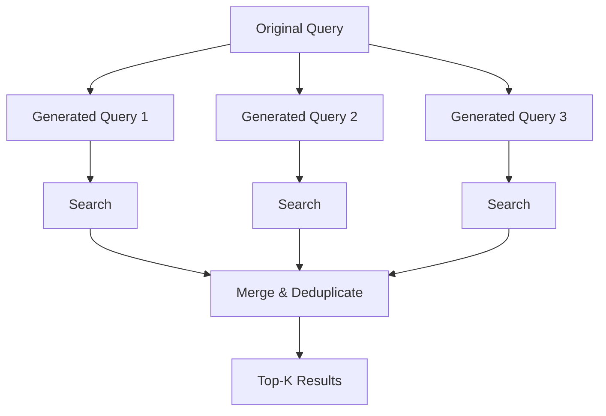

### 4. Reranking

After initial retrieval, a **reranker** model scores results more accurately:

```
Initial Search → 50 results → Reranker → Top 5 → LLM
```

---

## End-to-End Flow Diagram

### Complete RAG System Architecture

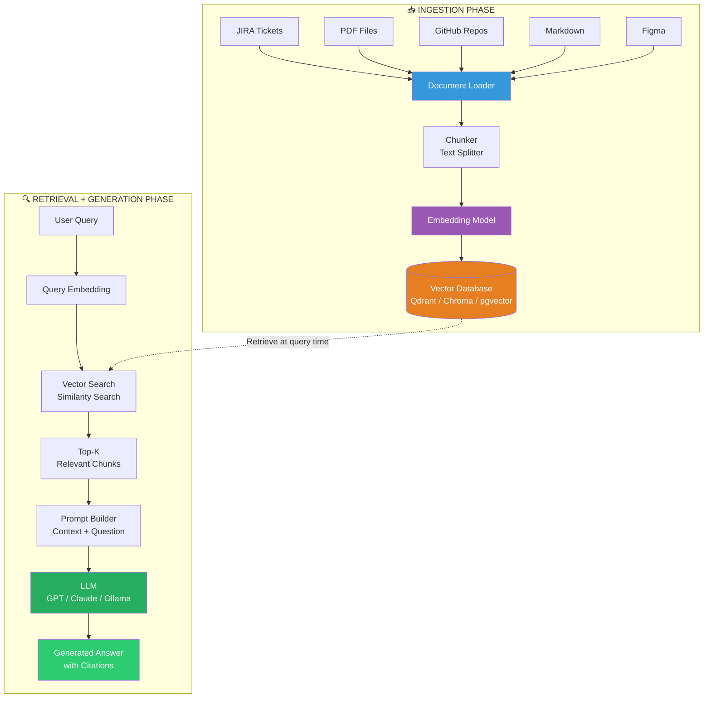

### Data Flow with Example

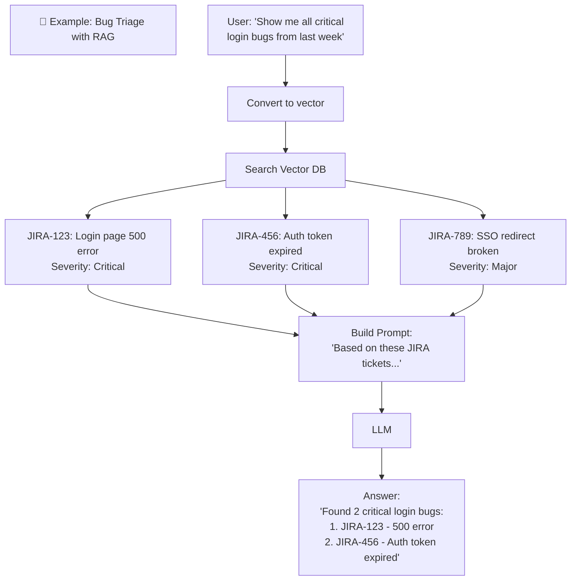

---

## Supported Document Types

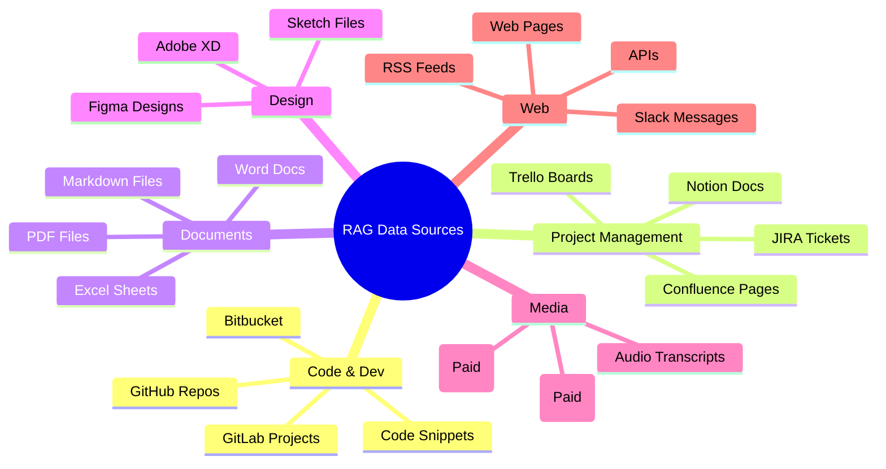

---

## Image & Video Support

### Can RAG handle images and videos?

| Media Type | Support | How It Works | Cost |
|---|---|---|---|
| **Images** | ✅ Yes (paid) | Multimodal LLM (GPT-4V, Claude 3.5) extracts text/context from images | Higher token cost |
| **Videos** | ✅ Yes (paid) | Transcribe audio → chunk transcript → embed text; or use multimodal for key frames | High cost |

### Image RAG Flow

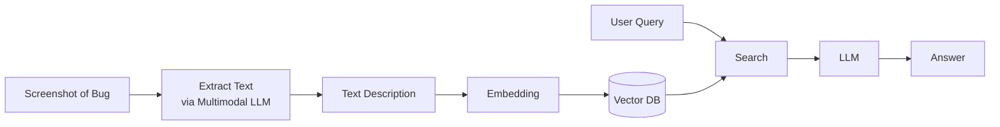

> **Note:** Free/open-source RAG setups typically handle text only. For image/video support, you need a paid subscription to a multimodal model provider.

---

## Popular Vector Databases

| Database | Type | Best For | Self-Hosted | Cloud |
|---|---|---|---|---|
| **Qdrant** | Dedicated vector DB | Production, high performance | ✅ | ✅ |
| **Chroma** | Embedded vector DB | Prototyping, small projects | ✅ | ❌ |
| **pgvector** | PostgreSQL extension | When already using Postgres | ✅ | ✅ |
| **Pinecone** | Managed vector DB | Cloud-native, no ops | ❌ | ✅ |
| **Weaviate** | Dedicated vector DB | Hybrid search, GraphQL | ✅ | ✅ |
| **Milvus** | Distributed vector DB | Large-scale, billion vectors | ✅ | ✅ |
| **FAISS** | Library (not DB) | Local, fast similarity search | ✅ | ❌ |

### Comparison

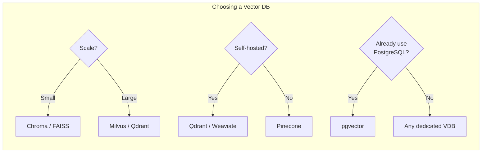

---

## RAG vs Fine-Tuning

```mermaid
graph LR
    subgraph "RAG"
        R1[+ No training needed]
        R2[+ Always up-to-date]
        R3[+ Source citations]
        R4[- Higher latency]
        R5[- API cost per query]
    end
    
    subgraph "Fine-Tuning"
        F1[+ Low latency]
        F2[+ No external dependency]
        F3[- Expensive to train]
        F4[- Static knowledge]
        F5[- Can still hallucinate]
    end
```

| Aspect | RAG | Fine-Tuning |
|---|---|---|
| **Knowledge freshness** | ✅ Always current | ❌ Static (retrain needed) |
| **Training cost** | ✅ None | ❌ High (GPU time) |
| **Hallucination risk** | ✅ Low (grounded) | ⚠️ Moderate |
| **Source citations** | ✅ Yes | ❌ No |
| **Latency** | ⚠️ Higher (retrieval) | ✅ Low |
| **Query cost** | ⚠️ Higher (context) | ✅ Lower |
| **Best for** | Factual Q&A, search | Style, tone, behavior |

---

## Common Challenges & Solutions

| Challenge | Problem | Solution |
|---|---|---|
| **Poor chunk quality** | Irrelevant chunks retrieved | Improve chunking strategy, add overlap |
| **Low relevance** | Top-K results not useful | Use hybrid search + reranker |
| **Hallucination** | LLM ignores context | Strengthen system prompt, lower temperature |
| **High latency** | Retrieval + generation too slow | Cache frequent queries, use smaller models |
| **Cost** | Too many tokens | Optimize chunk size, cache embeddings |
| **Stale data** | Vector DB has old info | Re-index on schedule (daily/weekly) |
| **Missing context** | Chunks too small | Increase chunk size or add overlap |

---

## Use Cases in QA & Testing

RAG is particularly powerful for QA Engineers and SDETs:

| Use Case | Description |
|---|---|
| **Bug Triage** | Query past bugs to classify new ones automatically |
| **Test Case Generation** | Retrieve similar test cases from history to generate new ones |
| **Regression Analysis** | Find all related bugs and test cases for a feature |
| **Knowledge Base Q&A** | Ask "How do we test login?" — get SOPs from docs |
| **Release Notes** | Summarize all fixed bugs from JIRA for a release |
| **Root Cause Analysis** | Find similar past incidents and their resolutions |

### Example: Bug Triage with RAG

```mermaid
flowchart TB
    subgraph "Bug Triage Agent"
        B[New Bug Report] --> BE[Embed Description]
        BE --> BS[Search Past Bugs]
        BS --> BR[Retrieve Similar Bugs]
        BR --> BP[Build Prompt:<br/>Past Bug Context + New Bug]
        BP --> BL[LLM Classifies]
        BL --> BO[Output:<br/>Severity, Priority, Component,<br/>Suggested Assignee]
    end
```

---

## Glossary

| Term | Definition |
|---|---|
| **RAG** | Retrieval-Augmented Generation — combining retrieval with LLM generation |
| **Embedding** | Converting text into a numerical vector representation |
| **Vector** | A list of numbers representing the semantic meaning of text |
| **Vector Database** | A DB optimized for storing and searching vectors by similarity |
| **Chunk** | A small piece of a larger document |
| **Chunking** | The process of splitting documents into smaller pieces |
| **Top-K** | The number of most relevant results to retrieve |
| **Similarity Search** | Finding vectors closest to a query vector |
| **Cosine Similarity** | A metric measuring how similar two vectors are (0 to 1) |
| **Reranker** | A model that re-scores retrieved results for better relevance |
| **Hybrid Search** | Combining vector search with keyword search |
| **Multimodal** | Models that can process text + images + audio |
| **Hallucination** | When an LLM generates false or unsupported information |
| **Augmentation** | Adding retrieved context to the LLM prompt |
| **Generation** | The LLM producing the final answer |
| **Ingestion** | The process of loading, chunking, embedding, and storing documents |
| **Metadata** | Additional info stored alongside vectors (source, date, etc.) |
| **Context Window** | The maximum tokens an LLM can process at once |

---

## Quick Reference — RAG Pipeline Summary

```
┌─────────────────────────────────────────────────────────┐
│                    RAG PIPELINE                          │
├─────────────────────────────────────────────────────────┤
│                                                          │
│  PHASE 1: INGESTION                                      │
│                                                          │
│  Documents → Chunking → Embedding → Vector DB            │
│     │           │           │            │               │
│  JIRA,PDF   Split by   Convert to   Store vectors        │
│  GitHub,    tokens/   numerical    + metadata            │
│  Markdown   sections  vectors                             │
│                                                          │
│  PHASE 2: RETRIEVAL + GENERATION                         │
│                                                          │
│  User Query → Embed → Search VDB → Top-K → LLM → Answer │
│      │         │         │          │       │       │    │
│   Question  Convert   Find most   Best   Inject  Final   │
│   asked     to vec    similar    chunks context  output   │
│                                                          │
└─────────────────────────────────────────────────────────┘
```

---

> **Created for:** AITesters BluePrint 4X  
> **Topic:** RAG (Retrieval-Augmented Generation)  
> **Last Updated:** 2026-09-19