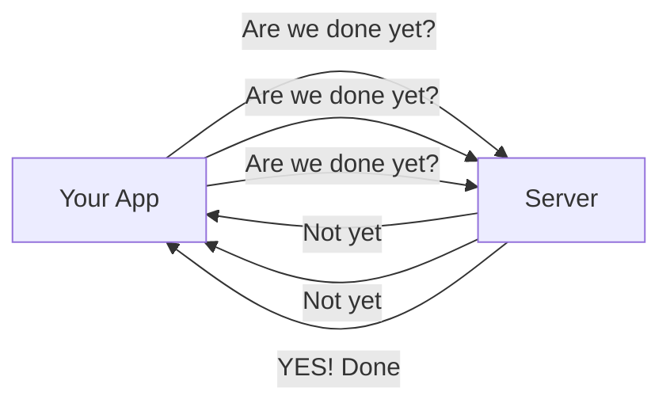
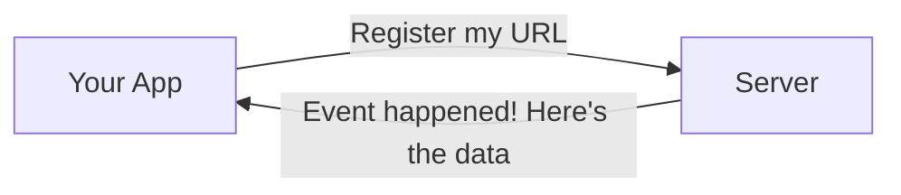
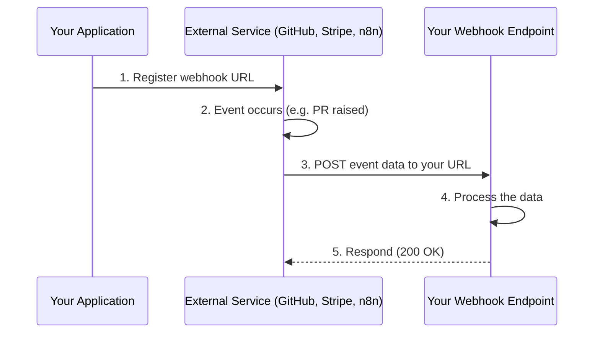
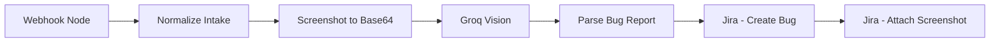

# Webhooks — Complete Understanding Guide

> **A beginner-friendly deep-dive into what webhooks are, where to use them, and how they work — with layman and real-time examples.**

---

## 📋 Table of Contents

1. [What is a Webhook?](#what-is-a-webhook)
2. [Webhook vs API (Polling) — The Key Difference](#webhook-vs-api-polling--the-key-difference)
3. [How a Webhook Works (Step by Step)](#how-a-webhook-works-step-by-step)
4. [Where Can We Use Webhooks?](#where-can-we-use-webhooks)
5. [Layman Example — The Doorbell](#layman-example--the-doorbell)
6. [Real-Time Example — Screenshot to Bug Reporter](#real-time-example--screenshot-to-bug-reporter)
7. [Anatomy of a Webhook Request](#anatomy-of-a-webhook-request)
8. [Common Webhook Use Cases](#common-webhook-use-cases)
9. [Webhooks in n8n](#webhooks-in-n8n)
10. [Webhooks vs Polling vs WebSockets](#webhooks-vs-polling-vs-websockets)
11. [Best Practices & Security](#best-practices--security)
12. [Glossary](#glossary)

---

## What is a Webhook?

A **webhook** is a **user-defined HTTP callback URL** that one system calls automatically to notify another system when a specific event happens.

In simple terms: **A webhook is a "doorbell" for your application.** Instead of you constantly checking whether something happened, the system *rings your doorbell* the moment it does.

### The Core Idea

```
[Event happens] → [System rings your webhook URL] → [Your app responds]
```

- **You register a URL** (the webhook endpoint) with a service
- **Something happens** (a bug is filed, a payment completes, a PR is raised)
- **The service calls your URL** with the event data (HTTP POST)
- **Your code processes** the data and takes action

---

## Webhook vs API (Polling) — The Key Difference

| Aspect | **API (Polling)** | **Webhook (Push)** |
|---|---|---|
| **Who initiates?** | You ask (pull) | They notify you (push) |
| **When?** | On a schedule / on demand | Instantly when the event happens |
| **Efficiency** | Wastes resources checking repeatedly | Zero waste, real-time |
| **Latency** | Delayed (depends on poll interval) | Instant |
| **Analogy** | Checking the mailbox every day | Mailman rings when mail arrives |
| **Cost** | More API calls = more cost | One call per event |

### Polling (API) — The "Checking" Approach



- You keep asking the server "is it done?" every few seconds
- Wastes resources, slow, and you might miss events between polls

### Webhook (Push) — The "Notification" Approach



- You register once, then the server calls you when something happens
- Instant, efficient, no wasted calls

---

## How a Webhook Works (Step by Step)



### The 5 Steps

1. **Register** — You give the service your webhook URL
2. **Event occurs** — Something happens on the service side
3. **Notification** — The service sends an HTTP POST to your URL with event data
4. **Process** — Your code handles the data (e.g., creates a Jira bug)
5. **Respond** — You return a success status (usually `200 OK`)

---

## Where Can We Use Webhooks?

Webhooks are used everywhere systems need to react to events in real time.

### 1. CI/CD & Code Review
- **GitHub/GitLab** → notify CI when code is pushed or a PR is raised
- **PR Review bots** → automatically comment on pull requests

### 2. Payments & E-commerce
- **Stripe/PayPal** → notify when a payment succeeds or fails
- **Shopify** → notify when an order is placed

### 3. Messaging & Collaboration
- **Slack** → notify a channel when a build fails
- **Microsoft Teams** → post alerts to a team channel

### 4. Project Management
- **Jira** → notify when a bug is created or status changes
- **Trello/Asana** → notify on card/board changes

### 5. Automation Platforms
- **n8n** → webhook node "listens" for incoming requests to trigger workflows
- **Zapier/Make** → trigger automations from external events

### 6. Monitoring & Alerts
- **Datadog/Grafana** → alert when a metric crosses a threshold
- **Status pages** → notify on incidents

### 7. QA & Testing
- **Screenshot to Bug Reporter** → UI sends screenshot to n8n webhook → creates Jira bug
- **Downtime tracker** → notify Slack when an app is down

---

## Layman Example — The Doorbell

### Scenario: Ordering Food at a Restaurant

**Without a webhook (Polling):**
You call the restaurant every 5 minutes:
> "Is my order ready? Is my order ready? Is my order ready?"

This is annoying for the restaurant, wastes your time, and you might miss the exact moment it's ready.

**With a webhook (Push):**
You give the restaurant your phone number (your webhook URL) and say:
> "Call me the moment my order is ready."

The restaurant **calls you** the instant your food is done. You don't have to check — they ring your doorbell.

```
You give restaurant your number  →  Restaurant calls you when ready  →  You pick up food
```

**Mapping to webhooks:**
| Restaurant Analogy | Webhook Concept |
|---|---|
| Your phone number | Your webhook URL |
| Order is ready | The event happens |
| Restaurant calls you | Service sends HTTP POST |
| You pick up food | Your app processes the data |

---

## Real-Time Example — Screenshot to Bug Reporter

This is the exact workflow you built in this repository.

### The Scenario

A QA tester finds a UI bug and wants to file it quickly. Instead of typing out every visual detail, they upload a screenshot and the system automatically creates a Jira bug.

### The Flow

```mermaid
flowchart LR
    A[QA Tester] -->|"Uploads screenshot + logs"| B[Vercel UI]
    B -->|"POST multipart form"| C[n8n Webhook]
    C -->|"Trigger workflow"| D[Groq Vision]
    D -->|"Analyze image"| E[Parse Bug Report]
    E -->|"Create issue"| F[Jira - Create Bug]
    F -->|"Attach screenshot"| G[Jira - Attach Screenshot]
```



### Step-by-Step

1. **QA tester** uploads a screenshot (e.g., `login_bug.png`), types error logs, and enters a Jira project key (`VWO`)
2. **Vercel UI** packages the data into a `FormData` object and sends it via `fetch()` to the webhook URL:
   ```
   POST https://aitestersqa.app.n8n.cloud/webhook/screenshot-to-bug-webhook
   ```
3. **n8n webhook node** "hears the doorbell" — it receives the request and triggers the workflow
4. **Groq Vision** analyzes the screenshot and drafts a structured bug report (title, description, steps to reproduce, expected/actual behavior, severity)
5. **Jira node** creates a Bug in the `VWO` project
6. **Jira node** attaches the original screenshot to the bug

### Why a Webhook Here?

- The UI **pushes** the data to n8n the moment the tester clicks "Draft and file the Bug"
- No polling needed — the workflow runs instantly
- The tester gets immediate feedback (bug link, title, description)

---

## Anatomy of a Webhook Request

When a service calls your webhook, it sends an HTTP request. Here's what it looks like:

### HTTP Request

```
POST /webhook/screenshot-to-bug-webhook HTTP/1.1
Host: aitesterqa.app.n8n.cloud
Content-Type: multipart/form-data; boundary=----WebKitFormBoundary7MA4YWxkTrZu0gW

------WebKitFormBoundary7MA4YWxkTrZu0gW
Content-Disposition: form-data; name="Screenshot"; filename="login_bug.png"
Content-Type: image/png

[the actual binary image bytes]
------WebKitFormBoundary7MA4YWxkTrZu0gW
Content-Disposition: form-data; name="Error logs"

TypeError: Cannot read property 'x' of undefined
------WebKitFormBoundary7MA4YWxkTrZu0gW
Content-Disposition: form-data; name="Jira project key"

VWO
------WebKitFormBoundary7MA4YWxkTrZu0gW--
```

### Key Components

| Component | Description | Example |
|---|---|---|
| **Method** | Usually `POST` | `POST` |
| **URL** | Your registered endpoint | `/webhook/screenshot-to-bug-webhook` |
| **Headers** | Content type, auth tokens | `Content-Type: application/json` |
| **Body** | The event data (JSON or multipart) | `{ "event": "bug_created", ... }` |
| **Signature** | Optional security token | `X-Hub-Signature: sha256=...` |

---

## Common Webhook Use Cases

| Use Case | Service → Your App | What Happens |
|---|---|---|
| **PR Review Bot** | GitHub → VPS | Auto-comments on PRs with code review |
| **Payment Success** | Stripe → Your App | Marks order as paid |
| **Build Failure** | CI/CD → Slack | Posts alert to channel |
| **Bug Filed** | UI → n8n → Jira | Creates Jira bug with screenshot |
| **Downtime Alert** | Monitor → Slack | Notifies team app is down |
| **New Signup** | Auth → CRM | Adds user to CRM |
| **Deploy Complete** | Vercel → Slack | Notifies team deployment done |

---

## Webhooks in n8n

n8n has a **Webhook node** that acts as a trigger — it "listens" for incoming HTTP requests.

### How to Use

1. Add a **Webhook node** to your workflow
2. Set the **HTTP Method** (e.g., `POST`)
3. Set the **Path** (e.g., `screenshot-to-bug-webhook`)
4. Activate the workflow
5. n8n generates a URL like:
   ```
   https://aitestersqa.app.n8n.cloud/webhook/screenshot-to-bug-webhook
   ```
6. Any request to that URL triggers the workflow

### In Your Workflow



The webhook node is the **entry point** — it receives the screenshot and logs, then passes them through the rest of the workflow.

---

## Webhooks vs Polling vs WebSockets

| Feature | **Webhook** | **Polling** | **WebSocket** |
|---|---|---|---|
| **Direction** | Push (one-way) | Pull (request/response) | Bidirectional |
| **Real-time** | Instant | Delayed | Instant |
| **Connection** | Stateless (HTTP) | Stateless (HTTP) | Persistent |
| **Best for** | Event notifications | Periodic checks | Live chat, streaming |
| **Example** | GitHub → CI | Checking status every 5s | Live chat app |
| **Complexity** | Simple | Simple | Complex |

---

## Best Practices & Security

### ✅ Best Practices

1. **Always respond quickly** — return `200 OK` fast, process async if needed
2. **Validate the payload** — check the data is what you expect
3. **Handle retries** — services may retry if you don't respond
4. **Log everything** — keep records of received webhooks for debugging
5. **Make it idempotent** — processing the same event twice shouldn't cause issues

### 🔒 Security

1. **Verify signatures** — many services sign the payload (e.g., `X-Hub-Signature`)
2. **Use HTTPS** — never send webhook data over plain HTTP
3. **Validate the source** — ensure the request is from the expected service
4. **Don't expose secrets** — never put API keys in the webhook URL
5. **Rate-limit** — protect against abuse

---

## Glossary

| Term | Definition |
|---|---|
| **Webhook** | A user-defined HTTP callback URL called automatically when an event happens |
| **Endpoint** | The URL that receives the webhook request |
| **Payload** | The data sent in the webhook request body |
| **Event** | The trigger that causes the webhook to fire |
| **Callback** | A function/URL that is called when something completes |
| **Polling** | Repeatedly checking for changes on a schedule |
| **Push** | The service sends data to you without being asked |
| **Multipart/form-data** | HTTP format that carries both files and text fields |
| **CORS** | Browser security rule allowing cross-origin requests |
| **Signature** | A cryptographic token verifying the request is authentic |
| **Idempotent** | Processing the same event twice produces the same result |

---

## Quick Summary

> **A webhook is a doorbell for your app.** You register a URL, and when an event happens, the service calls that URL with the data — instantly, without you having to check.

**In this repository:** The Vercel UI "rings n8n's doorbell" (`/webhook/screenshot-to-bug-webhook`) with a screenshot, and n8n immediately runs the workflow to analyze the image and file a Jira bug.

---

> **Created for:** AITesters BluePrint 4X  
> **Topic:** Webhooks — Understanding Guide  
> **Last Updated:** 2026-09-20